# AAA swarm pass

This pass closes the gaps left in `docs/pr6-refinement.md` (its Limits section) and pushes the campus further on nine fronts: VFX, SFX, UI, UX, Sentinels, districts, buildings, Wardens and the world. Nine specialists worked in one checkout at the same time, each owning its files and adding commented hook lines elsewhere. A reviewer then rendered the result and filed findings, and a final fixer applied them.

Nothing here changes district canon, note content, footprints, the street grid, interaction targets, auth, live-data contracts or XP rules. All new art is code-built and all sound is Web Audio synthesis. No new runtime dependencies were added; one was removed.

## What each specialist shipped

| Area | New or main files | What changed |
|---|---|---|
| VFX | `web-src/b_vfx.js` | One pooled effects layer on a shared GPU clock: write sweeps up a building's facade on every live edit, pooled bursts and halos, Sentinel lift trails, a district light curtain, daily-seeded weather (mist, drizzle, rain, wet glossy ground, wind in the trees), water reflections of the skyline and lamps, a per-time colour grade, and live quality tiers (high, a new phone MID tier, low). WebGL context loss now pauses and shows a status card instead of a black canvas. Five draw calls with everything live. |
| SFX | `web-src/b_audio.js`, `scripts/generate_audio.py` | The app no longer fetches audio: all seven bank sounds and 12 footstep variants are synthesized on unlock. Audible wind and hum (the old loops sat below 18 Hz and 110 Hz). One ambient bed per district theme (19), crossfaded as you cross districts, with day birds and bells and night crickets and owl. Footsteps by surface. `VaultAudio.sfx()` with 15 named cues, positional voices (HRTF on desktop, equal-power on phones), a 28-voice cap and master, music and effects sliders. |
| UI | `web-src/b_hud.js`, `web-src/a_head.html` | Named loading steps with a page-count bar, a toast stack (max 3, de-duplicated, dismissable), live district counts instead of a hardcoded 19, a fallback navigator with no inline styles, a `?` shortcut sheet listing only shortcuts that exist, combobox and listbox semantics on the switcher, type, motion and focus tokens, WCAG AA text tokens in the light theme, and HUD glass that tints with the sky phase (golden, dusk, night) or turns to warm paper by day. |
| UX | `web-src/g_ux.js` | Ctrl/Cmd+K Go-to palette (actions, districts, Wardens, agents, notes), `[` and `]` to step through nearby buildings from the keyboard with screen-reader announcements, a four-step First walk coach, a first-visit checklist per district, one-time hints, clickable breadcrumbs, Undo (also Ctrl+Z), an offline pill, a resumable boot with a retry card, and first-run quality detection from the GPU string, memory, cores and data saver. |
| Sentinels | `web-src/b_sentinel.js`, `web-src/b_identity.js` | A crowd director: distance LOD with pose rates of 1, 1/2, 1/4 and 1/8, no posing off screen, detail props dropped at LOD 2 and 3, and a frame budget that lets idle roofs stop forcing full-rate renders. Street lane offsets and pairwise separation, lift queue slots, a forge sweep on level-up, directed conversations with a beam between speakers, procedural panel lines, edge wear and grime, positional footfalls, and rank chevrons that now actually show. |
| Districts | `web-src/b_districts.js` (DistrictLook), `web-src/b_world_assets.js` | 19 distinct paving patterns, per-district trees, lamp and bench finishes, crest-topped gateways with name plates and banners, activity beacons over each landmark (height from open tasks, brightness from the last 7 days of writes), an entry moment that lights the gate and sweeps a ring across the paving, and moving landmark parts (crane, telescope, robot arm, audit wheel and others) held still under reduced motion. |
| Buildings | `web-src/b_buildings.js` (Facades) | Facades read note metadata: five window patterns by district style, fresh notes glow warmer, stale ones cool, archived and superseded notes weather with boarded windows and moss, notes edited in the last hour stand in scaffolding. One instanced draw adds lit doors, awnings, blade signs, balconies, frayed stubs for unresolved links and masts on the best-linked notes. Door lights follow the open note and task state. Hover labels gain a facade line. |
| Wardens | `web-src/c_npc.js`, `scripts/render_warden_portraits.mjs` | Portraits are looked up by district slug through a manifest (19 regenerated, no 404s), with a fallback chain down to a painted bust. Wardens patrol, greet you at the district entrance, and escort you to a landmark's door. Each archetype has its own cadence, opening line and gesture. A ninth reply finds missing links. Phone layout with a swipeable chip row. Per-Warden render budget and a frustum test. |
| World | `web-src/c_campus.js`, `web-src/b_engine.js`, `web/sw.js`, `vercel.json`, CI | A far shore with hills, two towns and a lighthouse, boats, piers and bird flocks, a moon in today's real phase, a turning star field with the Milky Way, eased time-of-day glides with lamps switching on one by one, night window occupancy, quay foam, contact shadows, arcing camera flights with orbit collision, photo mode (P), frame-total perf counters, a native Catmull-Rom rail that replaces the Babylon and anime bundle (about 102 KB less to parse), a service worker, a Content-Security-Policy, and a CI browser job that uploads evidence. |
| Notes | `web-src/d_reader.js`, `scripts/canon.py` | The reader gains a stats strip, a reading-progress bar, resume position, heading and block links, foldable callouts, numeric column alignment and a Connections footer (backlinks with context, Fly to chips, previous and next, history). `scripts/build.py` now prints a canon report (spelling, voice, orphans, dead ends, archive records); `--canon-strict` is available but off by default. |

## Review findings and fixes

The reviewer rendered the integrated build at 13:00, 18:30 and 22:00 on desktop and phone and filed 12 findings. All 12 were fixed.

| Severity | Finding | Fix |
|---|---|---|
| Major | Far-shore towns rendered as a flat brown block above the horizon at dusk and night. | The town base now starts from the hazed ridge colour and darkens at night. Far windows are sparse, stable lit dots on a 2×2 window cell (average floor `0.22+0.12*uOcc`) instead of a uniform tint, and the cards pull toward the haze with distance like the ridges. |
| Major | Landmark metal parts rendered near black: dark metal with no environment map. | `DistrictAssets.build` takes the renderer; metal and accent buckets get the Sentinels' prefiltered env map (`envMapIntensity .8`) and register for GPU-reset repointing. Without an env map they fall back to `#4A5568` at metalness .3. |
| Minor | `.btn` text colour switched instantly while its background faded, so theme changes flashed dark text on navy. | `color` joins the transition, and theme swaps set `html.theme-swap` for two frames with transitions off. |
| Minor | 18:30 looked the same as 22:00. | Auto sky now reaches full night at −16° sun elevation instead of −12°, with the dusk weight held longer (`t^0.7`). |
| Minor | On phones the First walk coach covered the in-world district title in close-ups. | In close-ups (walking, or camera distance under 160) on screens 760 px wide or less, the coach folds to its header. The fold is not stored, and tapping the header reopens it for that close-up. |
| Minor | A retry after the city booted did nothing, and a retry after a partial city step could build a second renderer. | `done.city` is set right after `Campus.boot()`. Frame hook, UI wiring, live layer and subscribe each have their own flag, so a retry resumes at the failed step and never repeats a finished one. |
| Minor | `refreshEnvironment` leaked the PMREM render target and missed materials outside the scene. | The target is kept and disposed whole. A registry of env-map materials (cleared on dispose) is repointed along with the scene. |
| Minor | Service worker cache name only changed with `package.json`, and the portrait manifest was served stale. | `build_web.py` bakes a 12-character content hash (page plus portrait manifest) into `VAULT_BUILD.hash`; the worker registers as `sw.js?v=<hash>`. `assets/**/*.json` is network-first. |
| Minor | CSP was only checked statically. | `tests/browser-smoke.mjs` serves every `vercel.json` header, including the CSP, and fails on any `securitypolicyviolation` or "Refused to" console line. |
| Minor | Wardens and the navigator said "medium" for tasks with no priority. | They now say "Its priority is not set." and "priority not set". The 80 XP bounty fallback is unchanged (it is an XP rule). |
| Minor | The first-visit checklist looked synced to the account. | A line under it reads "Checklist kept on this device." |
| Minor | The skip-walk toast told touch users to press Ctrl K. | Touch devices get "Go to (top bar) › First walk brings it back." |

## Validation

| Check | Result |
|---|---|
| `python3 scripts/build_web.py` | Built, 750 KB. Deterministic across two builds (asserted in `tests/swarm-integration.test.mjs`). |
| `npm test` | 183 of 183 passed across 34 test files. One earlier full run had 2 failures: an assertion pinned to the old `refreshEnvironment` source (updated) and the HUD browser test, which passed on rerun; specialists also reported that test as timing-sensitive under parallel load. |
| `python3 scripts/build.py --strict` | Passed. 1,405 notes, 13,752 links, 0 unresolved. The canon report lists 179 findings (94 "Vector Shift" spellings, 69 orphans, 8 dead ends, 5 banned words outside quotes, 3 archive records); it is informational and does not fail the build. |
| `node tests/browser-smoke.mjs` | Passed, now with the production CSP on every response. Desktop 1440×900 (high tier, sound on) and mobile 390×844 (low tier, reduced motion, touch): 0 console errors, 0 warnings, 1,405 buildings, 19 districts, 19 landmarks, 3 progress saves each. Sound pass: 7 of 7 bank sounds, 12 footstep variants, context running, 2 ambient loops, 15 of 15 cues played. |
| Frame draw calls (SwiftShader) | Desktop 486 to 822, mobile 572, read with `renderer.info` totals across shadow, scene and post passes. The range depends on which passes ran on the sampled frame; it is not a performance measurement. |

New or extended regression tests in this pass: `tests/review-fixes.test.mjs` (5), plus additions to `world-assets` (env map on landmark metals), `sentinel-crowd` (env target disposal and off-scene repointing), `warden-dialogue` (no invented priority), `engine-kit` (content-hash worker, fresh manifests), `ux-flow` (idempotent boot steps), `hud-polish` and `swarm-integration`.

## Render evidence

All shots are headless Chromium with SwiftShader and the mirrored notes. Clock values are local hours set through `Campus.debug().setClock`.

### Before the review fixes

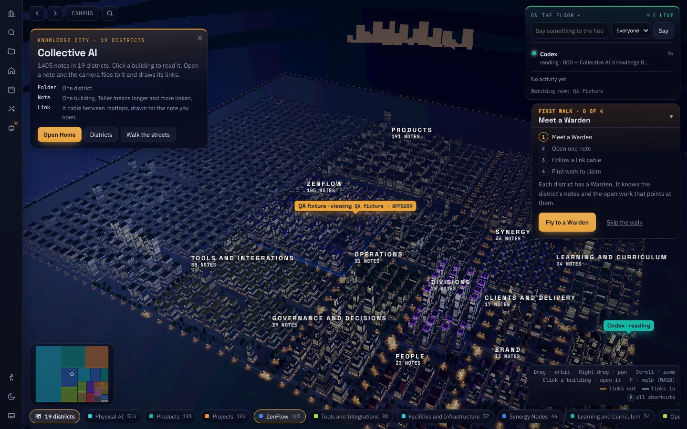
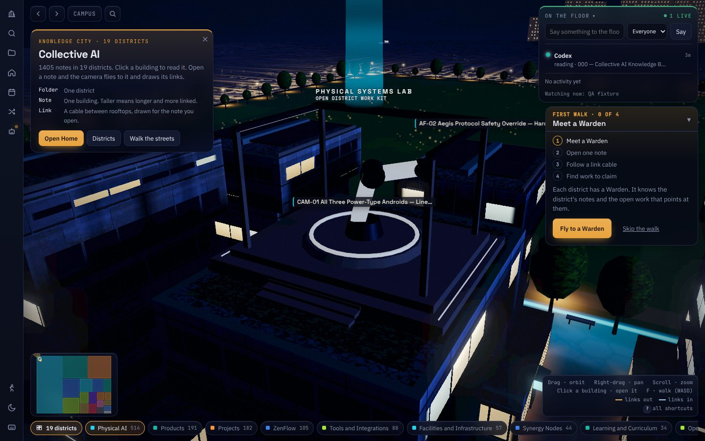

### After

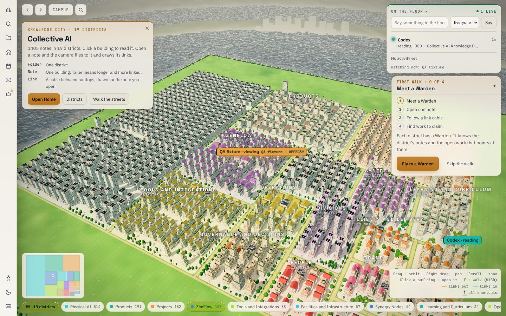
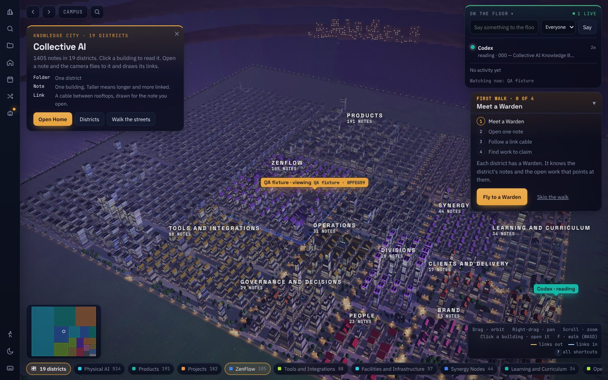
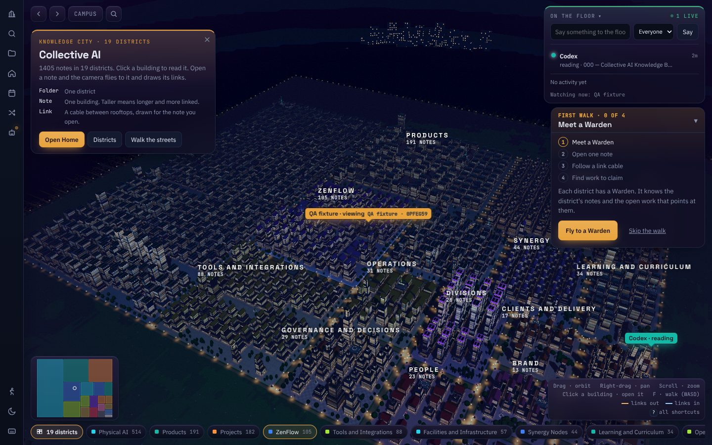
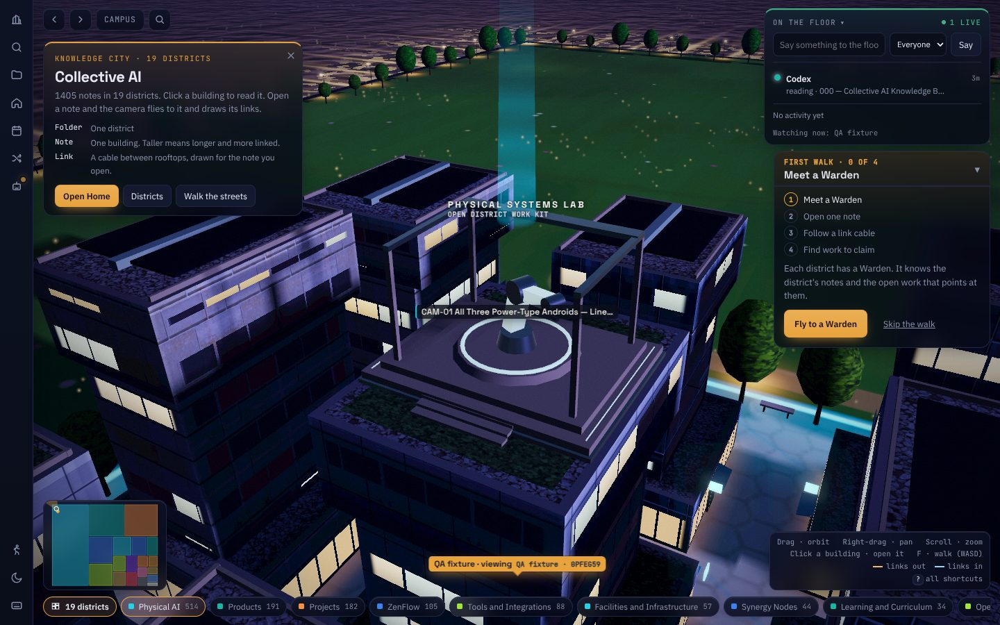
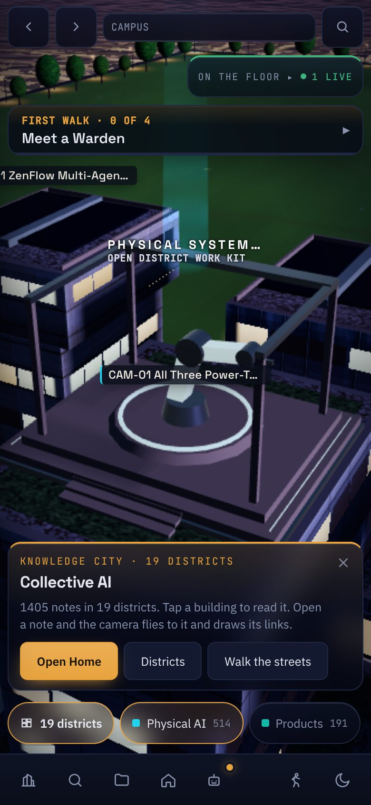
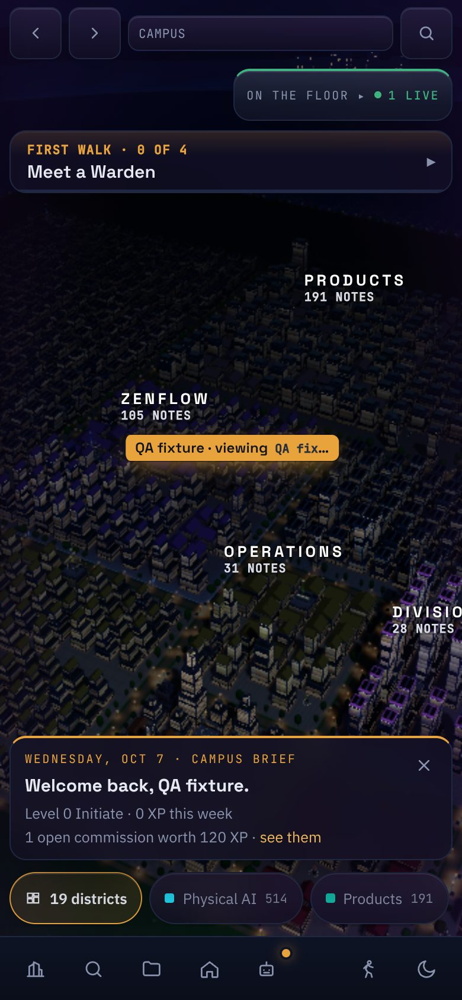

### Browser smoke

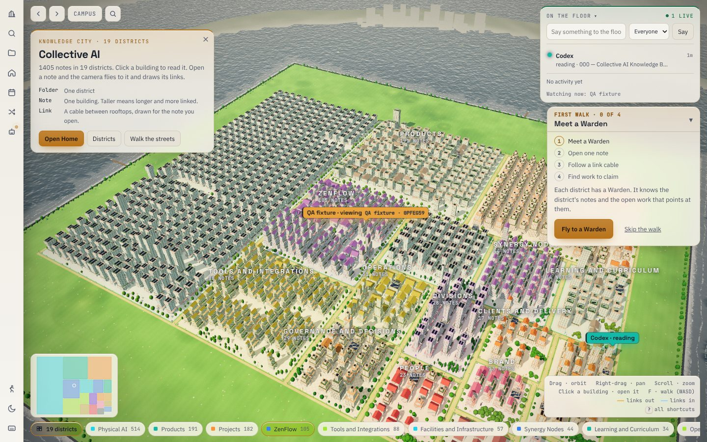
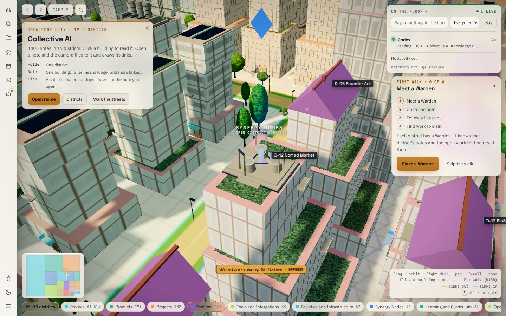
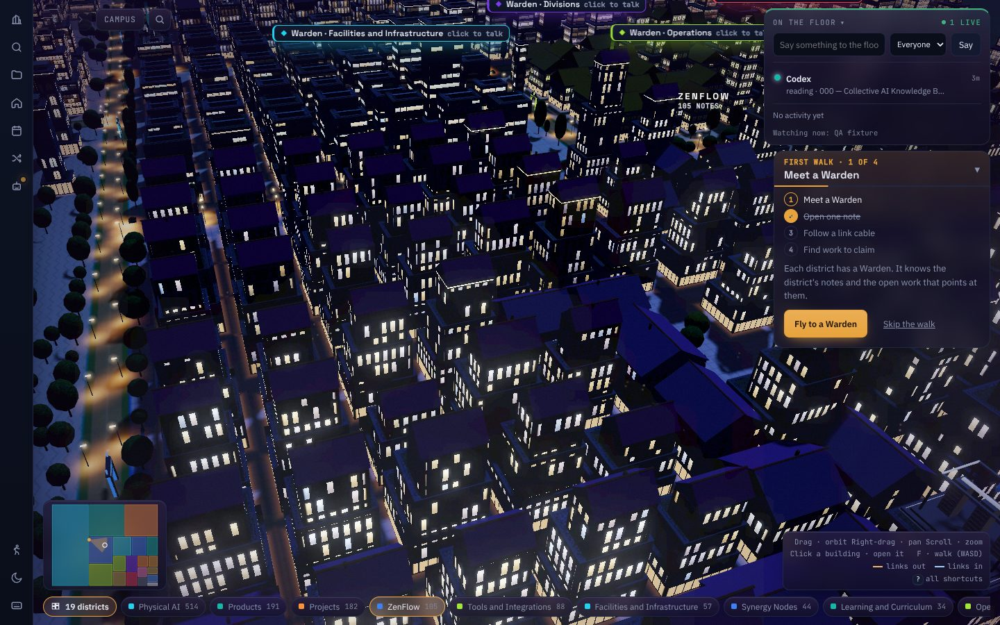
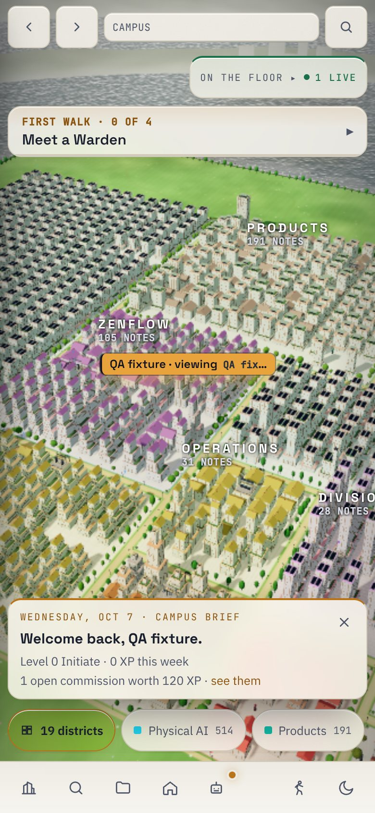
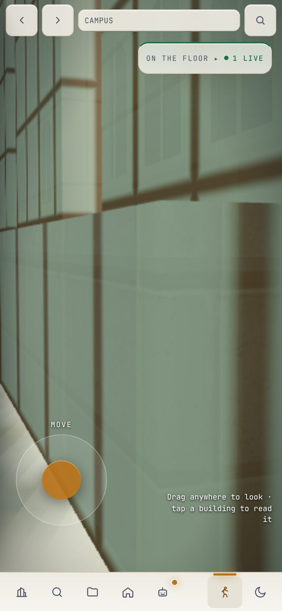

## Cutscenes

The swarm changed the campus but not the films that introduce it. This pass reworks every cutscene so each one shows the new work, and keeps their contracts: Skip, the reduced-motion still, autoplay-safe sound, mobile framing, the CSP and the title and menu markup.

### Title cinematic

`web-src/f_title.js` is still its own render (it plays before sign-in, before the city exists), but it no longer copies anything. Every district, building, weather and effect detail in it comes from the shared modules, and the state those modules keep is handed back before the city boots.

| Shared module | What the title takes from it |
|---|---|
| `VFX` (b_vfx.js) | Today's weather (`weatherFor`), rain streaks, motes and fireflies (`atmosphere`), the write sweep (`INK_GLSL`, `ink`), the light curtain (`district`), rings and light columns, the lift spark trail (`trail`, `arrive`), the conversation beam (`linkMaterial`), the per-time colour grade (`grade`) and the context-loss guard. `dispose()` and `setWeather(null)` on exit. |
| `DistrictLook` (b_districts.js) | The court paving (`paintCourt`, hex pattern for the lab), the entry inlay and ring (`patchGround`), the gateway crest, banners, name plates and activity beacon (`build`, `enter`). New `reset()` drops the title's layout and cached materials, which hold the title's lamp uniform. |
| `DistrictAssets` (b_world_assets.js) | The Physical systems lab landmark with its moving robot arm. Built without an env map, so the city's prefiltered env map is never made on the title's renderer. |
| `Facades` (b_buildings.js) | Doors, awnings, blade signs, balconies, a link mast, a frayed stub and scaffolding, laid out from `Facades.signal()` on six court notes (one edited 20 minutes ago, one with an unresolved link). `setDoor` lights the door for the open note. |
| `SentinelMesh`, `Guides` (c_npc.js) | Walkers, two talkers, a lift rider, and the lab's Warden, dressed by the new `Guides.costume()` with the same kit, archetype (herald) and opening line it uses in the city. |
| `VaultAudio.sfx` (b_audio.js) | Every beat is cut to an existing cue. The score stays the title's own synth and now pulses on every cut. |

Shot list. Eight shots, 2.8 s apart, each crossfading 0.6 s into the next; times are seconds from the start of the cold open.

| # | Shot | On screen | What it shows | Beat (time) and sound |
|---|---|---|---|---|
| 1 | sky | 0.0–3.4 | Night sky, the Milky Way, the moon in today's real phase (the campus formula), stars, then a tilt down to the city rising. On a dry day a passing shower crosses this shot and the next; on a wet day the day's own weather plays. | Slate 0.6. Score pad enters. |
| 2 | shore | 2.8–6.2 | Low over the water along the quay. The quay lamps light one by one beside the lens and run away along the shore; the lighthouse beam sweeps and flares when it faces the lens; the water mirrors the moon, the lighthouse, each lit lamp and the skyline glow. Far-shore hills and two lit towns. | Light leak and `transition` 2.65. One pentatonic tick per lamp, 3.25 to 5.33. |
| 3 | gate | 5.6–9.0 | From the forecourt to the lab's gateway: crest, name plates, banners, beacon, and the landmark's robot arm behind it. The gateway lights, a ring sweeps the paving and the light curtain rises. | `district.gate` 6.3, in the lab's bed key. |
| 4 | facades | 8.4–11.8 | A dolly through the court past the dressed note buildings, window glow on, scaffolding on the one edited this hour. A door lights for the open note. | `ui.open` 9.9. |
| 5 | sentinels | 11.2–14.6 | The push down the main avenue: walkers passing the lens, two Sentinels talking with a beam between them, one riding a lift up a facade with a spark trail, then landing with a ring. | `sentinel.lift` 11.9, `sentinel.land` 13.4. |
| 6 | write | 14.0–17.4 | A crane up a tower that rides with a live write: ring and light column at the base, the scanline up the facade, the roof flash. | `note.write` 14.8. |
| 7 | warden | 16.8–20.2 | The lab's Warden under its gateway turns to the lens and greets; the caption is its own opening line, "Word from Physical AI." | Greeting 17.4; six `warden.blip` in the herald voice from 17.7. |
| 8 | dawn | 19.6– | Pull back over the skyline at dawn: the sun over open sea (the far shore opens toward the sunrise), glitter on the water, lamps going out one by one from 21.8. Wordmark letters 20.2, sweep 22.0, VAULT 22.9, rule 23.3, tagline 24.2; menu 26.2, then the slow menu orbit. | Light leak 19.45. Arpeggio opens an octave; bass pulse under the gold sweep. |

The other paths are unchanged in contract:

| Path | When | What plays |
|---|---|---|
| Full | First visit of the day with the setting on | The eight shots above, 26.2 s to the menu. |
| Sting | Seen today, or Settings › Opening cutscene off | The wordmark over the finished dawn shot in 1.5 s. |
| Still | `prefers-reduced-motion` | One dawn frame, redrawn only on resize; menu at once. The lighthouse and the data motes hold still. |
| Skip | Skip button, any key, any tap | The menu at once. Captions and beats are never replayed on skip, so no burst of sound. |

Phone notes: every material compiles before the first frame (`renderer.compile`), so no shot hitches when its district first comes into view; the render path allocates nothing per frame; the phone MID tier renders at 1.5x pixel ratio and takes the MID weather budget, Low gets no weather points. Portrait screens keep the 16:9 horizontal field of view (capped at 78 degrees); wide shots pull back and the gate and Warden close-ups keep their distance.

### In-world moments

| Moment | Change |
|---|---|
| District entry after a flight (chips, navigator, Journey "Fly to district") | The card shows at once, but the gateway light, entry ring and light curtain now land as the camera arc arrives instead of at take-off behind the camera, with `district.gate` cut to the same frame (`districtMoment` in c_campus.js). Walking in still fires it at once. |
| Warden greeting at the district entrance | A ring in the district colour at the Warden's feet and a `warden.blip` in its archetype voice, positioned at the Warden. |
| Warden escort arrival | The camera settles low on the door and facade (`Campus.flyAt`), the door gets a light column, and `ui.open` plays at the door. |

Tests: `tests/cutscene.test.mjs` (12) covers the shot order and spacing, crossfade weights, beats inside their shots, every sound beat naming a real `VaultAudio` cue, the full, sting and still timelines, caption voice and width, the plan for reduced motion and repeat visits, Skip never replaying beats, the score's cut pulses with no negative WebAudio times at any join point, the shared-module wiring and hand-back, `DistrictLook.reset`, the in-world sync, and a real-browser pass through every shot on a 390x844 phone, Skip to the menu and the reduced-motion still.

After this pass: `npm test` 195 of 195 (35 files); `python3 scripts/build.py --strict` passed (1,405 notes, 0 unresolved, same 179 informational canon findings); `node tests/browser-smoke.mjs` passed on desktop and phone with 0 console errors and 0 warnings, which also proves the city boots cleanly after the title hands its shared state back.

### Cutscene evidence

Headless Chromium with SwiftShader, the built page with the production headers, `Title.debug()` holding the clock at each beat. Real renders, not generated art.

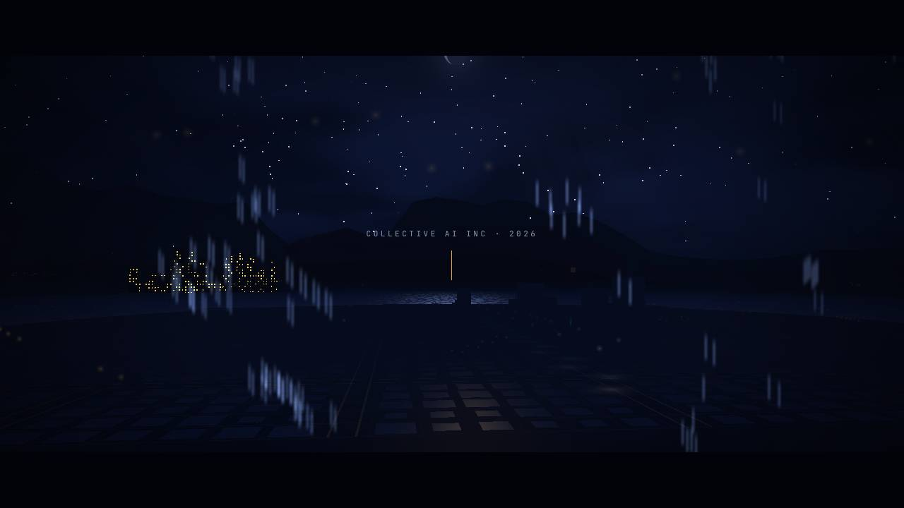
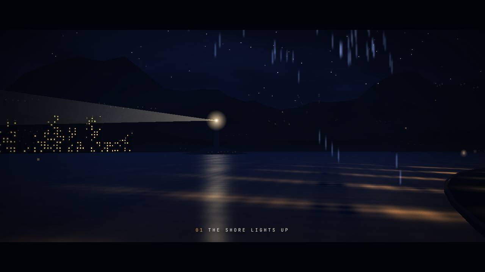
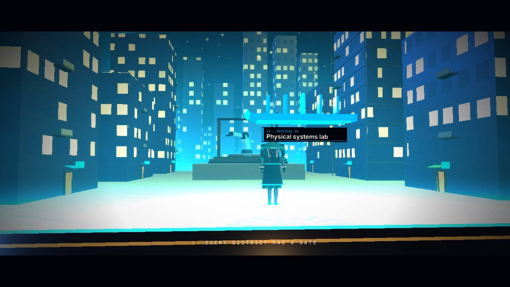
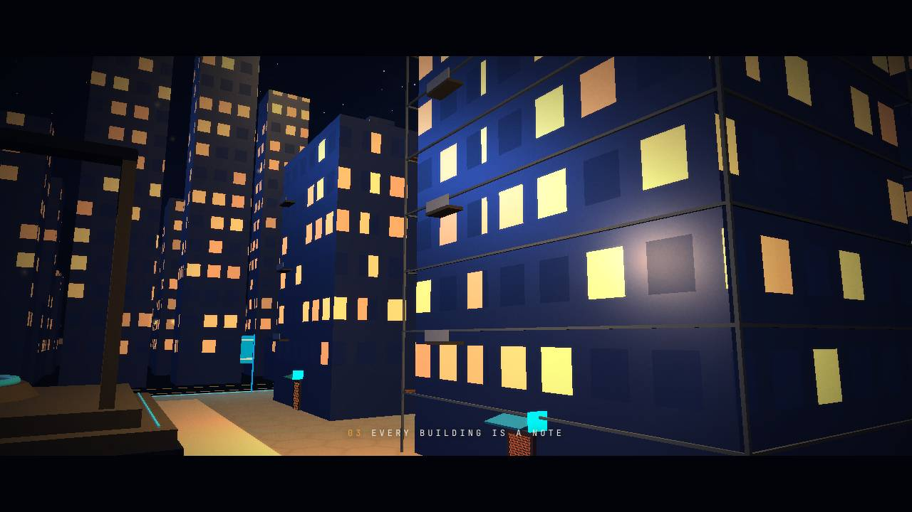
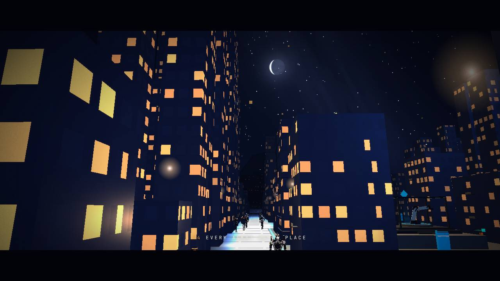
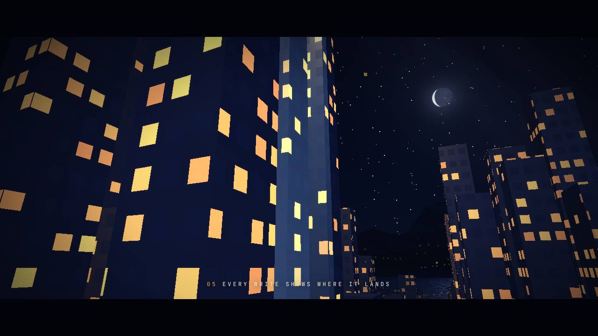
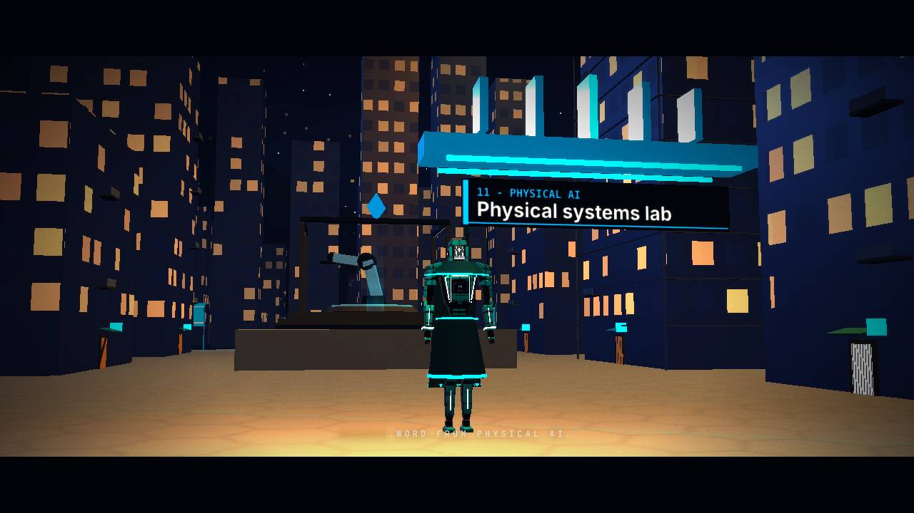
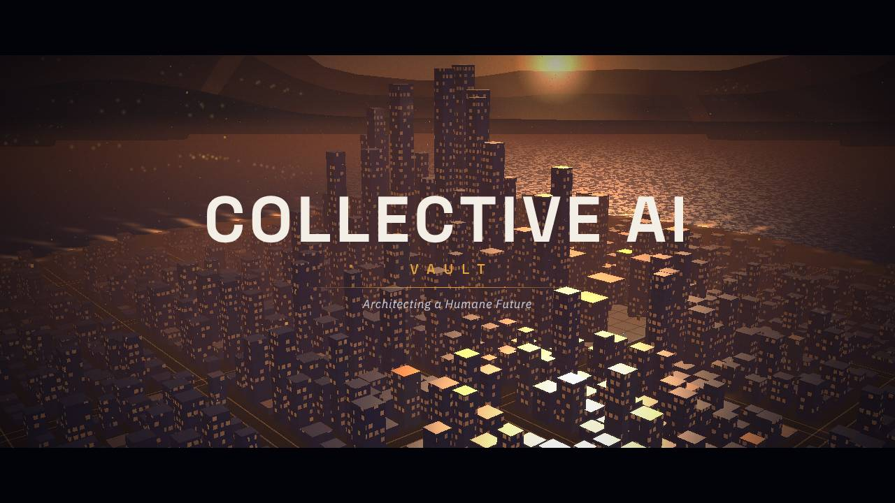
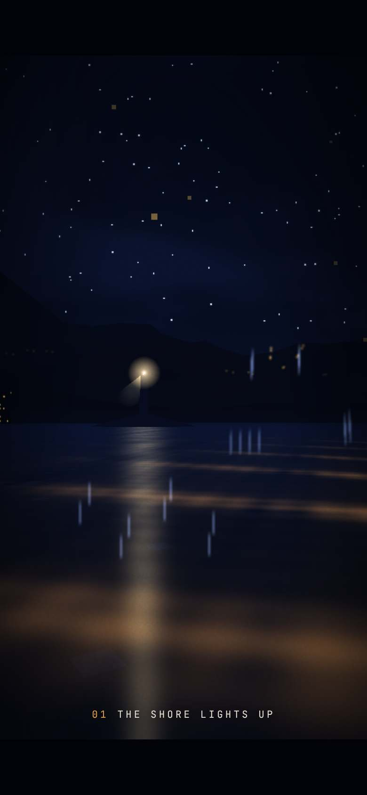
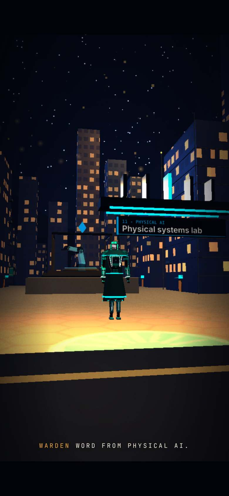
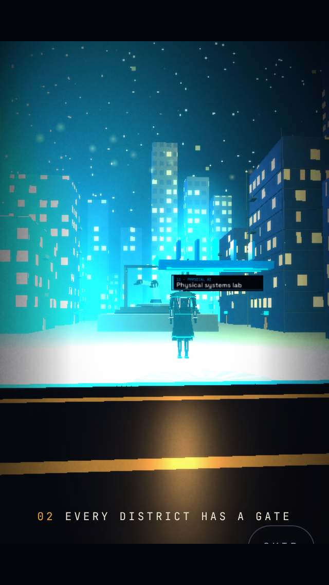
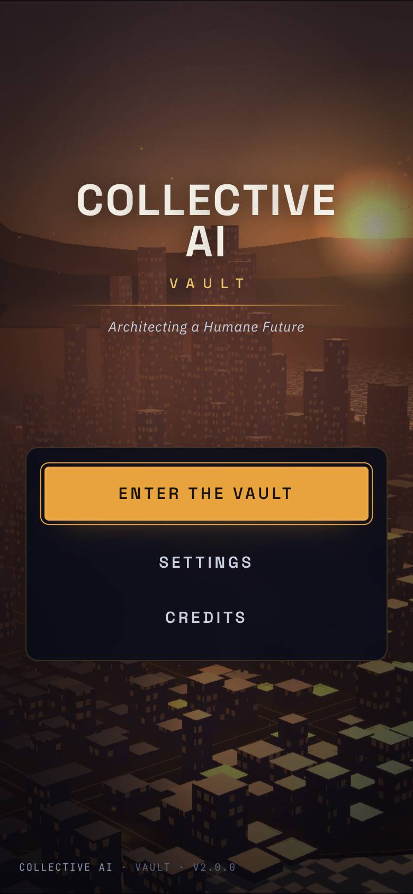

Cutscene limits:

- The in-world moments are covered by source tests, not by renders.
- SwiftShader runs the title at 0.3 to 4 frames a second, so frame rate on phones is not measured here; the frame budget is reasoned, not profiled.
- The light curtain is the campus's own effect at full strength; seen from the forecourt it washes the gate shot cyan for about two seconds.
- The write sweep is the campus's own subtle scanline; on a tall tower it reads as a light band, not a flare.
- On a dry day the passing shower is staged for the film; the city itself shows only the day's real weather.

## Limits

- No physical device was tested. Nothing here was measured on a Galaxy A15 or any phone; tier thresholds, LOD distances, Warden frame rates and instance budgets are estimates. All rendering evidence comes from SwiftShader, which is far slower than real GPUs and can freeze mid-transition.
- No audio was listened to on real speakers. Mix levels were set by calculation.
- The new shaders (weather, facades, Sentinel wear, far shore, landmark motion) compile and render in SwiftShader. Fragment cost on mobile GPUs is not profiled.
- Vault note fixes found by `scripts/canon.py` were not applied. `vault/` syncs to the live database and those edits need JR's approval. The 179 findings stand, and `--canon-strict` stays off in CI until they are fixed.
- The Warden panel still takes arrow and number keys when focus is on the page body or canvas, and is not aria-modal.
- Moving landmark parts and swaying banners cast rest-pose shadows. Raycasts use rest-pose geometry.
- Street lane offsets for Sentinels do not check against facades, so a figure can clip a wall edge on a narrow street.
- Scaffolding and freshness are computed at rebuild time, not on a live clock.
- Warden portraits were rendered from the build at the time; a visual kit change needs `node scripts/render_warden_portraits.mjs --prune` again.
- `web/audio/*.wav` are still deployed for the audition test but are no longer requested by the app.
- The CSP keeps `'unsafe-inline'` for scripts and styles because the app is one assembled inline page.
- Wayfinding colour overlaps between the six virtual districts and folder colours, and the minimap gaps (hover labels, heading wedge, markers, full-map view), are not addressed.
- The dusk timing change assumes the auto sky; the manual dawn preset still shares the dusk light direction.
