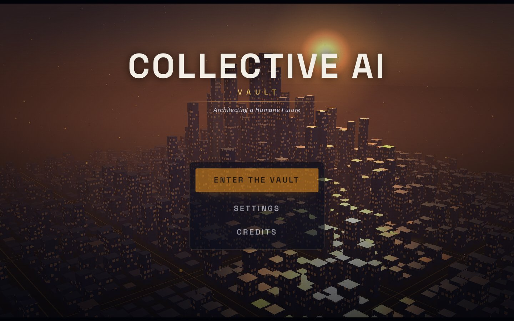
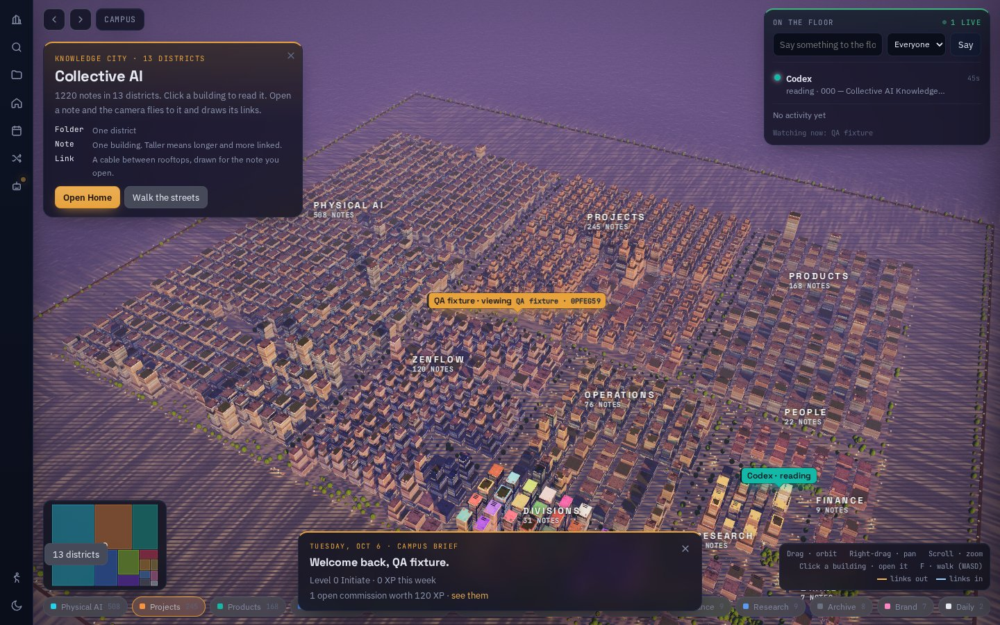
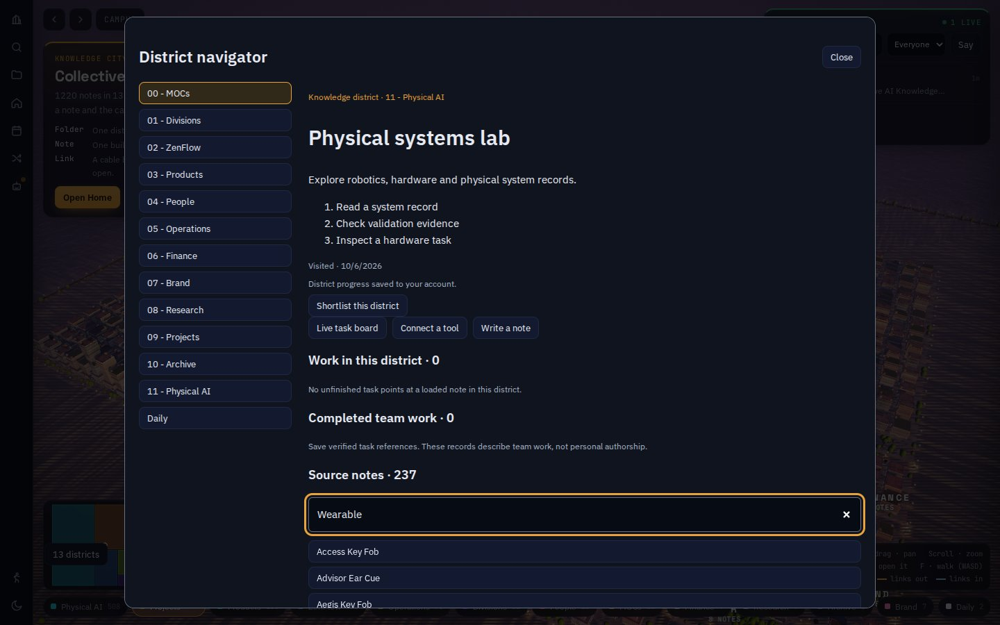
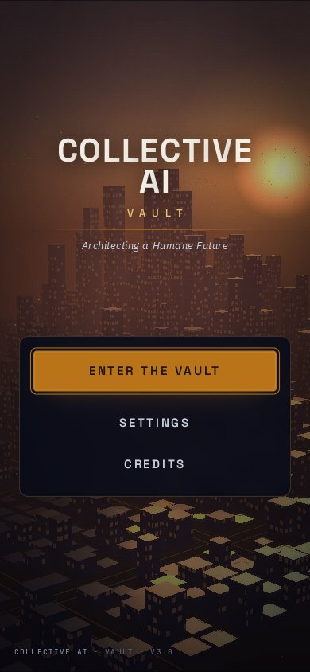
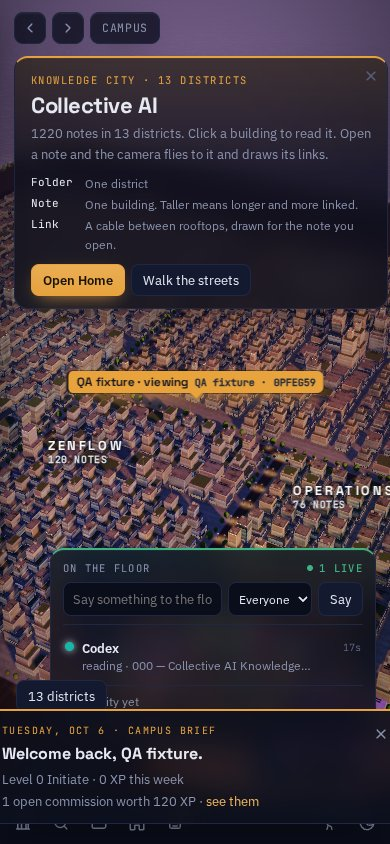
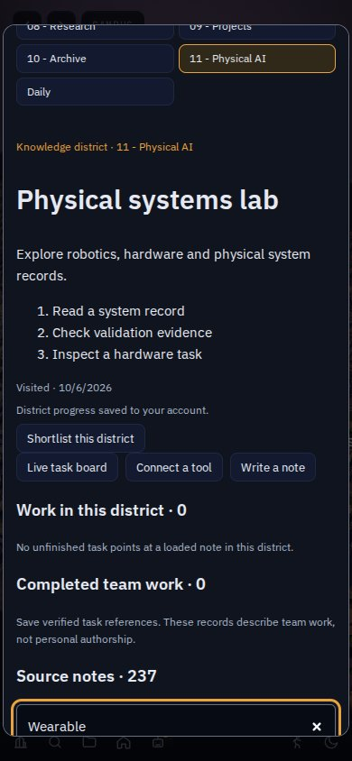

# Knowledge city upgrade

> [!note] Superseded
> Oct 7, 2026: the city now has 19 knowledge districts (13 storage folders plus six source-curated districts, 12–17) over 1,405 notes. See `docs/source-district-expansion.md`. The thirteen-district and 1,220-note figures below describe this upgrade as it shipped and are kept as history.

The city connects thirteen knowledge folders to actual notes and work. These are virtual knowledge districts, separate from the six physical Mega Campus districts. District display names are navigation labels, not new company divisions.

| Surface | Change |
| --- | --- |
| Districts | Thirteen registered work kits, note search scoped to the district, open task routing, writing desk and tool setup |
| Knowledge | Thirteen source-grounded handbooks, a reconciliation ledger, three evidence/decision/project templates and reciprocal hub links |
| City | Five stable architecture profiles, instanced street furniture and district entrances, lower mobile texture budget and adaptive resolution |
| Characters | Folded guide capes, layered clasps, filtered Sentinel machining detail and source-backed task/tool guidance |
| Cinematics | Live-rendered camera rails, film grading, restrained bloom, readable menu panel and reduced-motion handling |
| Sound | Seven original generated PCM WAVs, gesture-unlocked spatial mixer, ambient buses, footsteps, work notifications and mute |
| Progress | Member-owned visits and district shortlist; references to server-verified completed team tasks; no client XP awards |

## Engine and asset boundaries

Three r128 remains the city renderer to preserve existing materials, identity geometry and postprocessing. Babylon 9.29.0 supplies sampled camera rails. Anime.js 4.5.0 supplies cancellable reader transitions. Bundled local browser dependencies avoid requiring third-party script CDNs at startup. No second GPU context is created for Babylon.

Anime's optional Three adapter expects newer Three releases. This project uses the independent DOM animation API and keeps the existing city version. `.npmrc` disables peer resolution for this intentional split; the lockfile pins installed versions. `npm run build` rebuilds local vendor files and assembled app. Vercel continues serving committed `web/` output.

Audio is original synthesized ambience and Foley generated by `scripts/generate_audio.py`, not a claim of field recordings or licensed music. No image generation or prerendered video is used for the new cutscene effects. Existing authored image textures remain in use.

## Source authority

`docs/drive-source-provenance.json` records the discovered Drive source metadata. Seven relevant documents were read. The October 4 repository protocol overrides older PDFs: nine operating divisions, eleven chartered divisions, and ten Pending Until Activation. Historical veto, campus, revenue and director information is reconciled without replacing current canon. No complete confidential PDF is copied into git.

`scripts/complete_district_notes.mjs` plans by default and applies through the versioned live agent API when explicitly run with `--apply`. It reads before writes, appends missing sections and skips its existing section marker. New notes link to existing divisions and hubs; reciprocal links are added to their hubs.

## Production changes applied

- `district_journeys` migration applied to the existing Vault project. New tables enforce member ownership and deny direct client writes.
- `district-progress` version 1 deployed with JWT verification enabled. The endpoint derives the member from the verified JWT and limits bodies to 4 KB.
- Award hardening migration fixes two function search paths and revokes direct client execution of two trigger-only award functions. Authorized member RPCs remain available.
- Seventeen notes and their hub links were added through the live API. The mirrored vault contains 1,220 notes and 12,075 links with zero unresolved links.

The frontend remains on the PR branch until merge. Rolling back the frontend leaves additive progress tables available and does not require dropping data. Existing team identities, tokens and tool registrations are preserved.

## Validation

- All 36 Node tests pass, including PostgreSQL member isolation, denied spoofing/direct writes, completion evidence validation, awards, geometry budgets, audio and camera rails.
- All frontend JavaScript syntax checks pass; local vendor and web builds pass.
- Production progress RPC visit/shortlist operations passed in a transaction that was rolled back.
- Database advisors no longer report mutable award search paths or public execution of the trigger-only functions. Expected authenticated member RPCs and the existing password-protection setting remain advisory notices.

## Rendered browser check

Browser plugin unavailable; Playwright Chromium 141 with software WebGL was used. Desktop 1440×900 used high quality with motion; mobile 390×844 used low quality and reduced motion. Both loaded all 1,220 notes and all thirteen districts. Member identity and progress transport were mocked locally; this is not an authenticated production end-to-end test.

| Check | Desktop | Mobile |
| --- | --- | --- |
| Page identity and meaningful content | Pass | Pass |
| Error overlay absent | Pass | Pass |
| Console errors and warnings | 0 / 0 | 0 / 0 |
| City WebGL and local resource loading | Pass | Pass |
| District selection, shortlist, search and Escape | Pass | Pass |
| Reader content and transition isolation | Pass | Pass |

Flow: title → enter → rendered city → thirteen-district navigator → shortlist → Physical AI search → Escape → actual handbook reader. The seven WAV assets decoded in both views. A failed-source check prompted local bundling of fonts and postprocessing. The first screenshot review prompted menu contrast and grain fixes.

Reproduce: `npm ci`, `npm run build`, `npx playwright install chromium`, `npm run test:browser`. The browser test creates temporary screenshots/results and makes no production writes. Evidence JSON reports the final fullscreen pass draw call, not the full composer cost.

 Software WebGL rendering does not establish performance on a physical Galaxy A15, Steam Deck or console. Console-quality art approval and full authenticated external tool workflows remain unverified; no award, virality or hardware parity is claimed.
