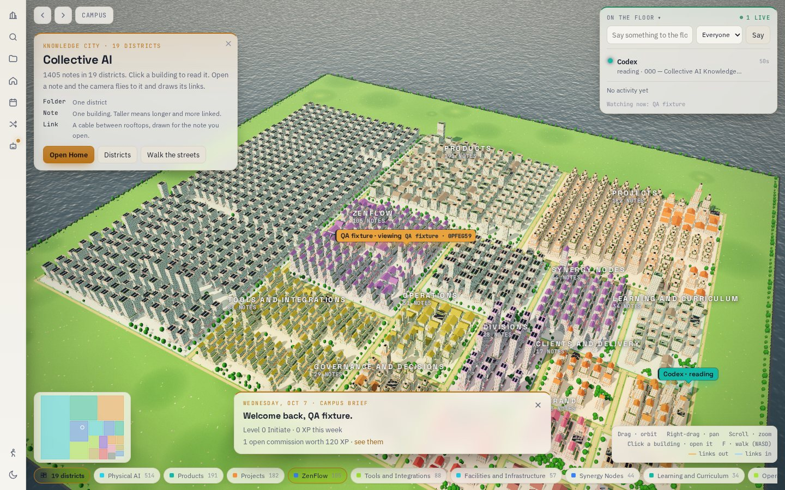
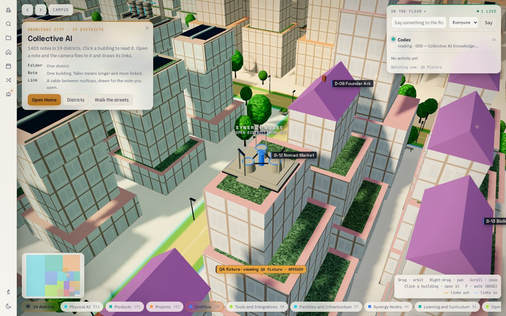
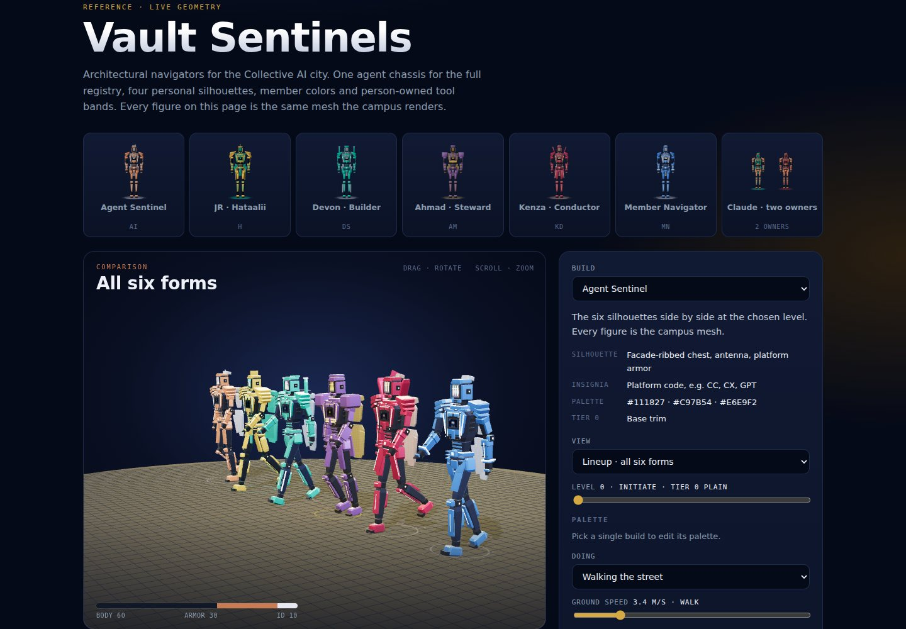
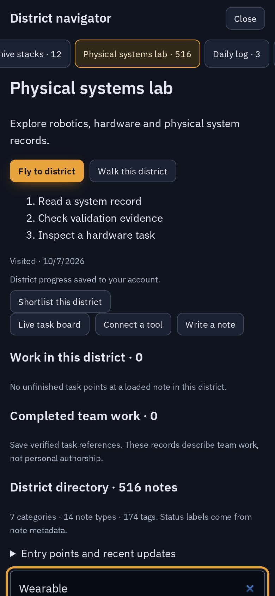

# PR6 campus refinement

This change builds on merged PR6. Four specialist agents handled architecture, district landmarks, sentinel rigs, and mobile interface behavior. A separate integration review checked their combined changes.

## Changes

- Nineteen district landmarks now have distinct architectural settings, layered terraces and recessed edge lights. Their transformed bounds determine roof fit; narrow and offset roofs are covered by tests.
- Three roof families add civic pavilions, solar terraces and observatory clerestories while retaining compact clay roofs and authored landmarks. Roof details use three additional shared instance batches.
- Sentinel feet follow the local roof surface, including during ridge crossings. Chimneys meet their slope. Task markers and cables clear the highest roof details. Identity and level changes preserve travel state.
- Sentinel capes blend across the waist. Cloak wind uses defined shader behavior, custom palettes retain their colors, armor highlights reveal bevels, and repeated timestamps cannot corrupt poses.
- Daylight fog, exposure and light intensity were calibrated against distant-view renders to keep the full city readable. Night and dusk settings are unchanged.
- Water excludes the island footprint. A controlled rendering comparison identified under-island water as the source of broad ground striping.
- Mobile history controls have 44px targets. The reader, floor, district actions, brief and Warden prompt have separate space. A closed reader cannot cover the bottom ribbon. Projected world labels avoid actual HUD rectangles.
- CI installs the pinned Playwright Chromium build before running browser-based regressions.
- The streak test explicitly uses UTC, matching the database assumption, so its results do not depend on the machine running the test.

## Preservation

No district canon, note content, authentication, ownership, XP rules, task APIs, street grid or building interaction footprints were changed. Generated HTML is built from source. No new dependencies or external visual assets are required.

## Validation

- Build passed. Automated regression suite: 69/69 passed. Full-city desktop and mobile browser smoke passed with zero console errors or warnings; results are in pr6-refinement-evidence/results.json.
- Strict knowledge check: 1,405 notes, 13,752 links, zero unresolved links.
- Browser test uses the complete mirrored repository notes and a mocked member session, progress transport and live activity. It makes no production writes.
- Desktop 1440×900 and mobile 390×844 are rendered with real WebGL. The mobile run uses reduced motion and touch input. Additional layout tests cover 320×568 and 740×360.
- All district fly/walk entry points are exercised. The reader, navigator, shortlist and touch joystick are checked. Screenshot cameras are deterministic evidence views, not a frame-rate benchmark.
- Six sentinel forms were visually inspected while walking; targeted tests cover finite poses, cape weights and identity rebuilds. Tier-zero models use seven visible draws each; district landmarks remain three merged surface draws.
- Generated HTML was rebuilt twice and its hashes matched.
- Anti-slop scanner: zero failures, nine warnings from existing branded type, layering, labels and gallery styling. Dispositions are recorded in design-ledger.json.

## Limits

Software WebGL and emulated phone dimensions are not physical Galaxy A15 performance validation. The browser run mocks authenticated transports; production multi-user behavior was not exercised. Automatic approval review rejected optional live presence updates, so no live vault status was written. Art is stylized architecture and mechanical figures; no photorealism, awards, virality or universal perfection is claimed.

The desktop compositor resets renderer counters for its final pass, so the sampled render-call field in browser evidence is not a total scene draw budget.

> [!note] Superseded
> Oct 7, 2026: the campus renderer now runs with `info.autoReset` off and clears the counters once per rendered frame, so `renderer.info.render.calls` is the frame total across shadow, scene, bloom and grade passes. `Campus.perf()` reports calls, triangles, CPU frame time (average and p95), memory counts, the adaptive scale and the world-pass layer counts.

## Render evidence

