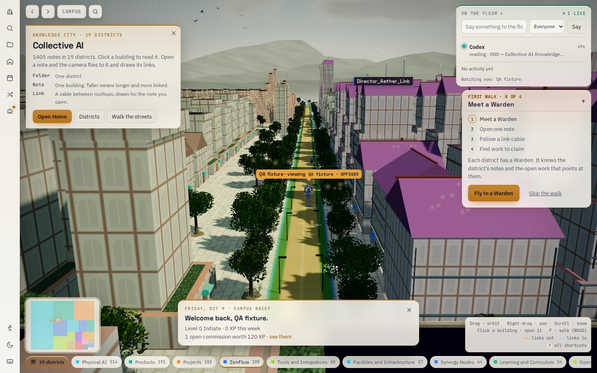
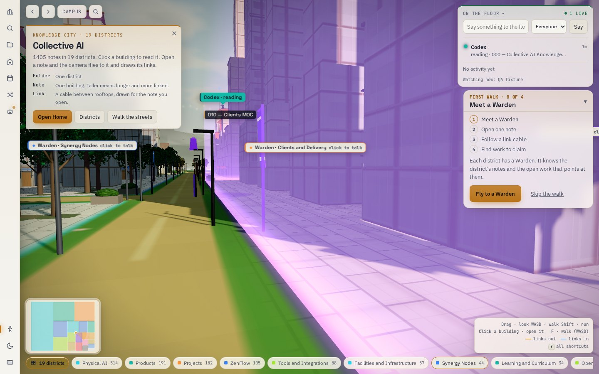
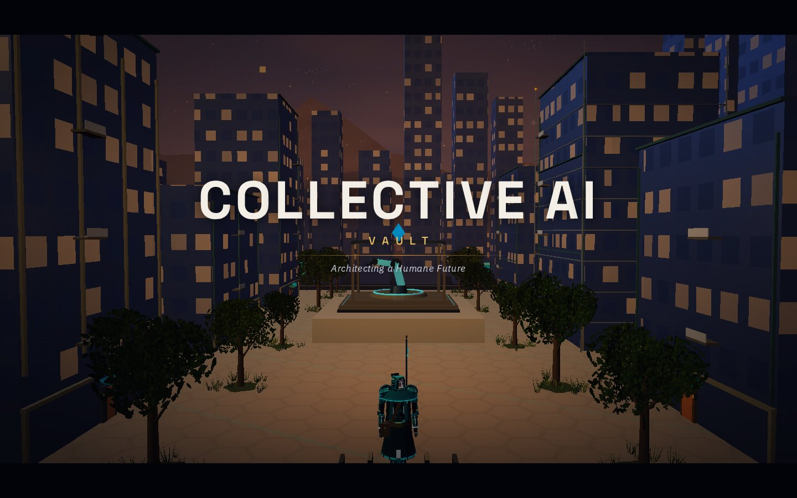
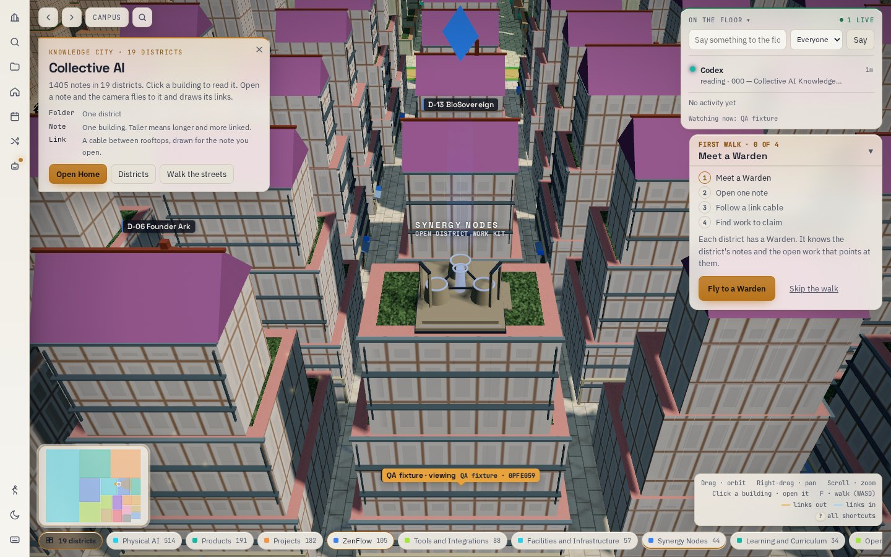
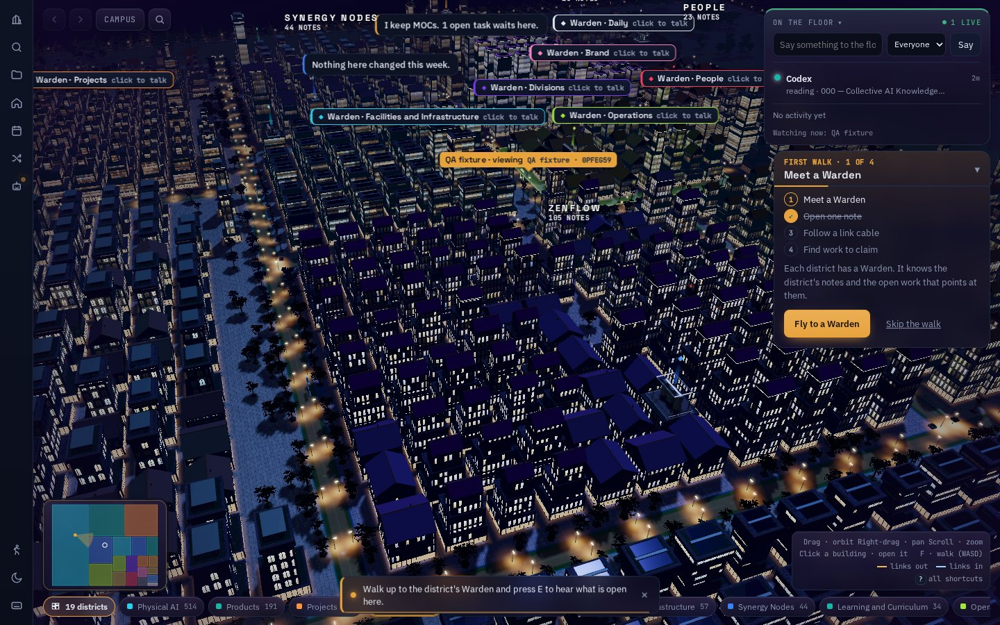
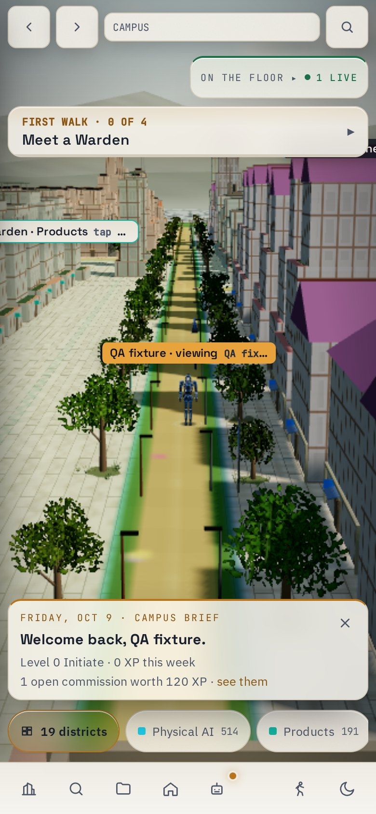
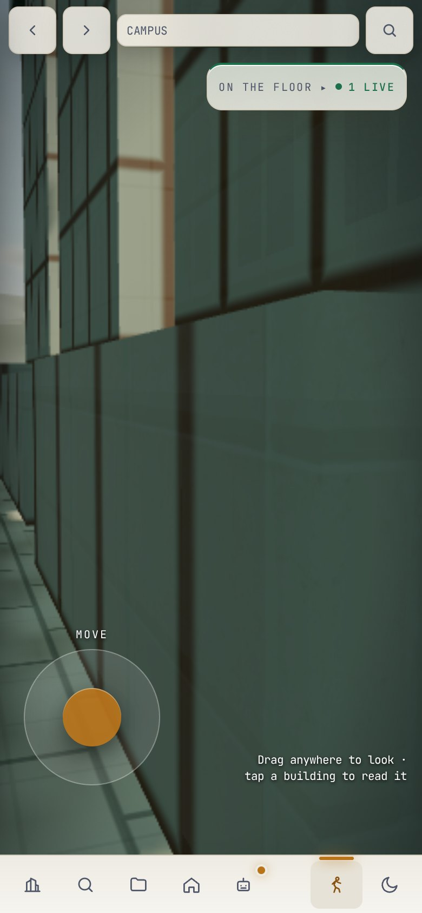

# Reference upgrade evidence

Captured with the production CSP and mocked local transport. No production records were changed.

- 200 non-browser tests passed (`unit-tests.txt`).
- Desktop high quality and mobile low quality / reduced motion browser scenarios passed (`results.json`).
- All 1,405 note buildings and 19 districts remain present; district travel, note reader, shortlist persistence, audio and touch walking pass.
- Both browser scenarios reported no runtime errors, warnings or tested HUD overlaps.
- Vercel reported successful deployment for the implementation commit.

Images show the implemented result, including its remaining visual gaps relative to the supplied reference. This is not a physical-device FPS measurement.

