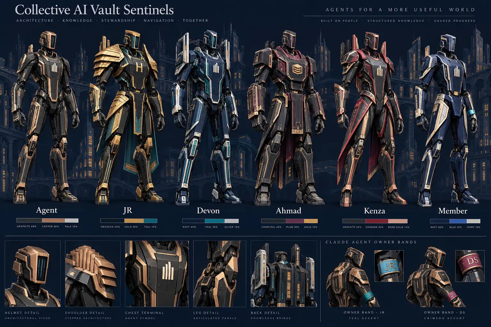

# Vault Sentinel upgrade

The city keeps its note buildings, districts, facade shaders, navigation, tasks and agent registry. Lantern markers become articulated architectural Sentinels. The agent chassis is shared across the full registry; each platform has its color and terminal insignia. Human navigators have separate silhouettes and account palettes.



The image is a design reference. The interactive `/sentinels.html` gallery renders the actual city mesh factory. Runtime geometry is lighter than the illustrated concept. It is not an exact high-detail reconstruction of the illustration.

| Build | Geometry | 60% body | 30% armor | 10% identification |
|---|---|---|---|---|
| JR / Hataalii | Athletic broad frame, stepped mantle, gold thigh plates | `#050A18` | `#D4A843` | `#00D9B5` |
| Devon | Twin shoulder rails and backpack bridge | `#0B1830` | `#00A994` | `#CED7E0` |
| Ahmad | Layered chest ledger and square guards | `#191923` | `#75518D` | `#C9A84C` |
| Kenza | Swept collar fins and split waist panels | `#151B29` | `#A62C48` | `#E7BBA0` |
| Member | Narrow jacket armor and paired chest rails | User hex | User hex | User hex |
| Autonomous agent | Shared facade-ribbed chassis | `#111827` | Registry platform color | `#E6E9F2` |

60:30:10 is the design allocation for body, armor and identification surfaces. Apparent pixel coverage changes with camera angle, light and pose. No exact screenshot-area percentage is claimed.

## Project structure

| Source | Responsibility |
|---|---|
| `web-src/a_head.html` | Existing responsive app shell and CSS |
| `web-src/b_data.js` | Notes, reader and the new Sentinel tab |
| `web-src/b_identity.js` | Validated palettes, profile forms, platform codes, owner badges and small editor illustration |
| `web-src/b_sentinel.js` | Shared actual Three.js geometry factory and disposal |
| `web-src/c_campus.js` | City layout, camera, movement and Sentinel placement |
| `web-src/d_live.js` | Authenticated profiles, walking positions, tool sessions, palette saving and core assignment |
| `web-src/e_boot.js` | Existing sign-in and startup |
| `scripts/build_web.py` | Generates the deployed app and actual-mesh reference gallery |
| `supabase/functions/session-heartbeat/index.ts` | Authenticated person-owned external tool heartbeats |
| `supabase/migrations/20261005070000_sentinel_identity.sql` | Additive profiles, sessions, walking rows, RLS and owner-only core assignment |

## Identity and live behavior

- Open Live → Sentinel to edit three `#RRGGBB` values. Values persist in `avatar_profiles` and stream to the team.
- The owner can assign JR, Devon, Ahmad and Kenza builds to existing accounts from the same tab. Core forms are account-bound. A display-name change cannot grant a core form.
- Walking avatars use authenticated `member_positions` rows with a browser UUID. RLS only permits writes for the authenticated account. Positions expire from view after 60 seconds without a heartbeat.
- Each tool Sentinel carries a platform insignia, owner band, owner code and owner name in its label. People can use the same platform at the same time without overwriting each other.
- Selecting a tool in the Sentinel tab shows its person-owned instance at the selected note. This is a declared tool association; it does not claim to monitor the tool's application automatically.
- External sessions call `session-heartbeat` with the member's Supabase auth JWT and a UUID session ID. The server derives the owner from the JWT; there is no caller-supplied owner ID.
- Existing shared agent tokens continue to update the autonomous agent row. They cannot identify which human is using the tool. Use the new member-authenticated endpoint for person-owned external sessions.
- Polling includes new sessions and walking rows when websockets are unavailable. Existing agents remain usable without the new migration. Palette saving is disabled until the tables are available.
- Rigid armor is merged by material. Limbs retain articulation. Resource disposal removes textures, materials and per-avatar geometry when an avatar leaves or changes colors. Shared base geometry stays cached.
- Your own avatar is hidden in first-person walking to keep it out of the camera. Other members still see it. Existing walking collision behavior stays in place.

## Activation order

1. Apply `20261005070000_sentinel_identity.sql` to the existing Vault project.
2. Deploy `session-heartbeat` with JWT verification enabled.
3. Deploy the PR frontend. In Live → Sentinel, assign the four existing team accounts. Member accounts start with the member build.
4. For person-owned external tools, send `POST /functions/v1/session-heartbeat` with `Authorization: Bearer <member-auth-JWT>` and this JSON:

```json
{"session_id":"a unique UUID per tool session","agent":"the existing registry agent ID","status":"reading","note":"Exact Note Name","detail":"Optional task detail"}
```

JWTs stay in tool secrets. Do not commit them or put them in query strings. A session with `status: offline` disappears immediately; other agent sessions age out after the existing 15-minute window.

## Validation and open gates

- `npm test`: palette rejection, six distinct silhouettes, material palette propagation, bounded per-avatar draw objects, 46 agents plus two same-tool owners, and resource disposal.
- `node --check web-src/*.js`: syntax checks, run per file in CI.
- `python3 scripts/build_web.py`: reproducible app and reference build.
- The generated image was visually inspected. The live app reaches its sign-in screen in the cloud browser.
- Full live identity, database RLS, actual rendered gallery, mobile WebGL and physical Galaxy A15 tests remain pending until preview and the Vault database are available. Local Chromium download failed and the cloud browser cannot access the local server.
- The connected Supabase account does not include the Vault project. The previously supplied access file has team and agent access, not migration or deployment credentials. The migration and new function are prepared in this PR; they have not been applied to production.
- Existing note-link validation is unchanged. No notes, canon, tasks, passcodes, tokens or existing database records are edited by this PR.

Rolling the frontend back leaves the original vault operational. New tables can remain in place; the older frontend ignores them. Do not drop the new tables as part of a frontend rollback.
