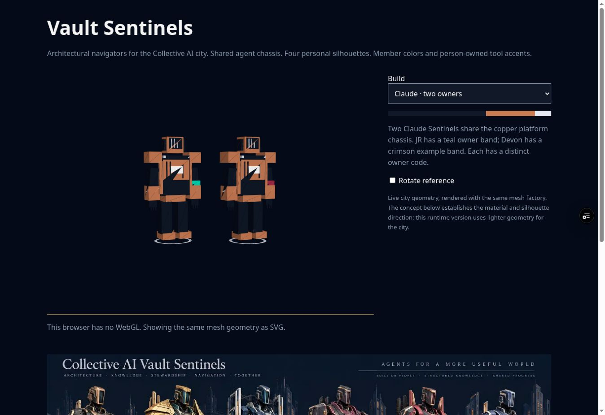
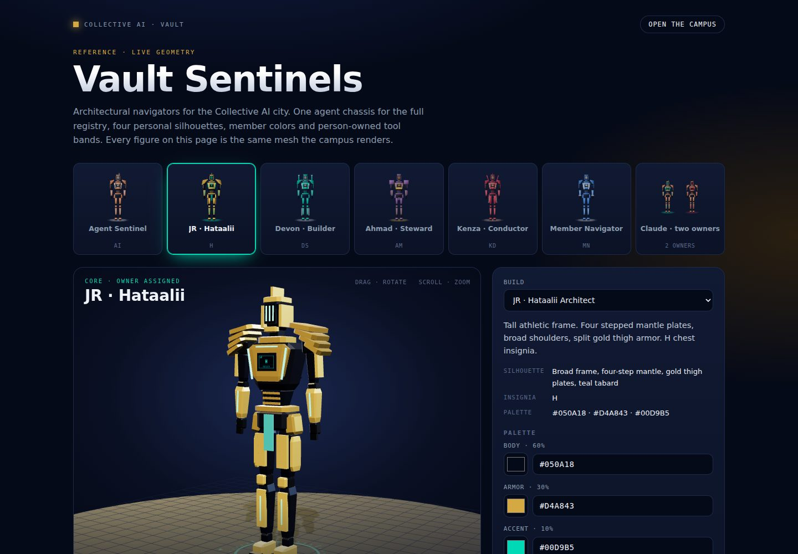
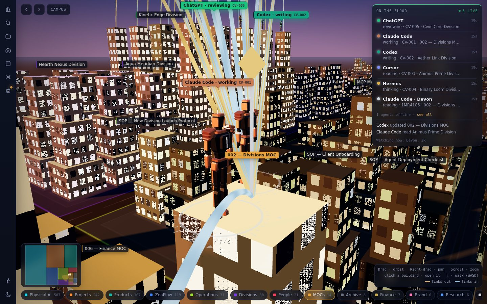

# Vault Sentinel upgrade

The city keeps its note buildings, districts, facade shaders, navigation, tasks and agent registry. Lantern markers become articulated architectural Sentinels. The agent chassis is shared across the full registry; each platform has its color and terminal insignia. Human navigators have separate silhouettes and account palettes.


The image is a design reference. The interactive `/sentinels.html` gallery renders the actual city mesh factory. Runtime geometry is lighter than the illustrated concept. It is not an exact high-detail reconstruction of the illustration.

| Build | Geometry | 60% body | 30% armor | 10% identification |
|---|---|---|---|---|
| JR / Hataalii | Athletic broad frame, stepped mantle, gold thigh plates | `#050A18` | `#D4A843` | `#00D9B5` |
| Devon | Twin shoulder rails and backpack bridge | `#0B1830` | `#00A994` | `#CED7E0` |
| Ahmad | Layered chest ledger and square guards | `#191923` | `#75518D` | `#C9A84C` |
| Kenza | Swept collar fins and split waist panels | `#151B29` | `#A62C48` | `#E7BBA0` |
| Member | Narrow jacket armor and paired chest rails | User hex | User hex | User hex |
| Autonomous agent | Shared facade-ribbed chassis | `#111827` | Registry platform color | `#E6E9F2` |

60:30:10 is the design allocation for body, armor and identification surfaces. Apparent pixel coverage changes with camera angle, light and pose. No exact screenshot-area percentage is claimed.

## Project structure

| Source | Responsibility |
|---|---|
| `web-src/a_head.html` | Existing responsive app shell and CSS |
| `web-src/b_data.js` | Notes, reader and the new Sentinel tab |
| `web-src/b_identity.js` | Validated palettes, profile forms, platform codes, owner badges and small editor illustration |
| `web-src/b_sentinel.js` | Shared actual Three.js geometry factory and disposal |
| `web-src/c_campus.js` | City layout, camera, movement and Sentinel placement |
| `web-src/d_live.js` | Authenticated profiles, walking positions, tool sessions, palette saving and core assignment |
| `web-src/e_boot.js` | Existing sign-in and startup |
| `scripts/build_web.py` | Generates the deployed app and actual-mesh reference gallery |
| `supabase/functions/session-heartbeat/index.ts` | Authenticated person-owned external tool heartbeats |
| `supabase/migrations/20261005070000_sentinel_identity.sql` | Additive profiles, sessions, walking rows, RLS and owner-only core assignment |

## Identity and live behavior

- Open Live → Sentinel to edit three `#RRGGBB` values. Values persist in `avatar_profiles` and stream to the team.
- The owner can assign JR, Devon, Ahmad and Kenza builds to existing accounts from the same tab. Core forms are account-bound. A display-name change cannot grant a core form.
- Walking avatars use authenticated `member_positions` rows with a browser UUID. RLS only permits writes for the authenticated account. Positions expire from view after 60 seconds without a heartbeat.
- Each tool Sentinel carries a platform insignia, owner band, owner code and owner name in its label. People can use the same platform at the same time without overwriting each other.
- Selecting a tool in the Sentinel tab shows its person-owned instance at the selected note. This is a declared tool association; it does not claim to monitor the tool's application automatically.
- External sessions call `session-heartbeat` with the member's Supabase auth JWT and a UUID session ID. The server derives the owner from the JWT; there is no caller-supplied owner ID.
- Existing shared agent tokens continue to update the autonomous agent row. They cannot identify which human is using the tool. Use the new member-authenticated endpoint for person-owned external sessions.
- Polling includes new sessions and walking rows when websockets are unavailable. Existing agents remain usable without the new migration. Palette saving is disabled until the tables are available.
- Rigid armor is merged by material. Limbs retain articulation. Resource disposal removes textures, materials and per-avatar geometry when an avatar leaves or changes colors. Shared base geometry stays cached.
- Your own avatar is hidden in first-person walking to keep it out of the camera. Other members still see it. Existing walking collision behavior stays in place.

## Activation order

1. Apply `20261005070000_sentinel_identity.sql` to the existing Vault project.
2. Deploy `session-heartbeat` with JWT verification enabled.
3. Merge/deploy the PR frontend after the remaining validation gates. JR is already assigned; in Live → Sentinel, assign Devon, Ahmad and Kenza after their named accounts sign in. Member accounts start with the member build.
4. For person-owned external tools, send `POST /functions/v1/session-heartbeat` with `Authorization: Bearer <member-auth-JWT>` and this JSON:

```json
{"session_id":"a unique UUID per tool session","agent":"the existing registry agent ID","status":"reading","note":"Exact Note Name","detail":"Optional task detail"}
```

JWTs stay in tool secrets. Do not commit them or put them in query strings. A session with `status: offline` disappears immediately; other agent sessions age out after the existing 15-minute window.

## Validation and open gates

- `npm test`: six tests pass, including isolated PostgreSQL RLS checks for owner assignment, own-account writes and rejected identity spoofing; live-layer simultaneous session separation and older-schema fallback; palette rejection, six distinct silhouettes, material palette propagation, bounded per-avatar draw objects, 46 agents plus two same-tool owners, and resource disposal.
- `node --check web-src/*.js`: syntax checks, run per file in CI.
- `python3 scripts/build_web.py`: reproducible app and reference build.
- The generated image and deployed gallery screenshot were visually inspected. The gallery controls, JR silhouette, member armor recoloring and two Claude owner bands were checked in the cloud browser at 1349 × 926. The browser has no WebGL context; the gallery projects the same mesh geometry into SVG as a fallback. The protected Vercel preview is Ready. GitHub Actions reported a startup failure with zero jobs; CI did not run. CodeRabbit skips automatic review of draft PRs.
- On 2026-10-05, with explicit owner approval, the production migration was applied and `session-heartbeat` v1 deployed ACTIVE with JWT verification enabled. All three new tables have RLS enabled; their expected policies are installed, and authenticated profile updates are restricted to the palette column. An unauthenticated endpoint request returned HTTP 401.
- The verified JR owner account is assigned the JR form with `#050A18`, `#D4A843`, `#00D9B5`. Devon, Ahmad and Kenza do not yet have named team accounts; their builds are ready for owner assignment after normal sign-in. No accounts were invented or assigned based on display-name guesses.
- End-to-end authenticated tool sessions, GPU city rendering, mobile WebGL and physical Galaxy A15 tests remain pending. Local Chromium download failed; the cloud browser has no WebGL context. Production frontend remains unchanged until the PR is merged.
- Existing note-link validation is unchanged. No notes, canon, tasks, passcodes, tokens or existing database records are edited by this PR.

Rolling the frontend back leaves the original vault operational. New tables can remain in place; the older frontend ignores them. Do not drop the new tables as part of a frontend rollback.

## Visual comparison ledger

| Point | Evidence and decision |
|---|---|
| Palette | Midnight background and named body/armor/accent hex codes match the reference direction. Member armor edits update the geometry preview. |
| Silhouette | JR has the stepped mantle, Devon twin rails, Ahmad square ledger and Kenza split panels. Geometry tests assert all six meshes differ. |
| Shared-tool ownership | The deployed reference shows separate teal/crimson wrist bands on the same Claude chassis. Live-layer tests keep two account-owned sessions separate from autonomous Claude. |
| Detail | The illustrated concept has bevels, joints and material weathering beyond the runtime mesh. This is an explicit visual limitation, not a claim of exact concept fidelity. |
| Controls and copy | Build selection, three labeled hex inputs, 60:30:10 swatches and explanatory text are native controls. No unexpected labels were added during browser verification. |
| Rendering | The cloud browser lacks WebGL. The reference gallery fallback was fixed and verified. GPU city rendering remains an open check. |
| Mobile | The existing city responsive shell is retained; gallery media queries are present. Mobile viewport and physical device checks remain open. |



## Finish pass · Oct 5, 2026

The Sentinels move to the concept sheet's proportions, and the vault gets a finish layer. Functionality, element IDs, data flows, tables, RLS and the API are unchanged.





### Sentinel geometry

| Change | Detail |
|---|---|
| One blueprint | `Identity.blueprint(form)` holds every part: shape, size, position, rotation and material slot. The 3D mesh and the 2D account preview are both built from it, so the two views cannot drift apart. |
| Proportions | 5.7 m figure, eight heads tall. V-shaped chest, narrow waist, tall tapered helmet, long tapered limbs. The previous figure was about five heads tall with a box torso. |
| Plates | Chamfered unit cube and a tapered variant replace the plain box for parts thicker than 9 cm. Thin trims stay boxes to save vertices. |
| Identification | Visor glass with three lit slits, lit chest trims, collar line, spine and limb strips. The chest terminal carries a frame, a four-bar mark, the symbol and the owner code. |
| Ring | Flat compass ring: lit band, 36 ticks, four chevrons. It turns slowly and pulses. |
| Forms | JR: four-step mantle, crest, gold outer thigh plates, teal tabard. Devon: shoulder rails with caps, bridge backpack, shin rails. Ahmad: square guards, chest ledger, plum coat, forearm guards, flat helmet cap. Kenza: collar fins, helmet fin, split waist panels on each leg. Member: chest rails, wrist accents. Agent: facade ribs, antenna. |
| Owner band | On the right forearm of person-owned tool Sentinels, lit in the owner's color. |
| Metals | A prefiltered dusk environment (PMREM) gives the armor reflections. Built once per renderer. Without WebGL or a renderer the materials fall back to lower metalness. |

### Motion

`SentinelMesh.pose(model, seconds, moving)` is shared by the campus and the gallery. Moving: leg stride, counter-swinging arms, step bob. At rest: breathing, an occasional visor scan, a glow pulse and ring rotation. Each Sentinel has its own phase, so a rooftop group does not move in step. Reduced-motion users get a still figure, as before.

### Budget

| Measure | Before | After |
|---|---|---|
| Draw objects per Sentinel | 9 | 10, JR 11 (test limit 12) |
| Vertices per Sentinel | 1,410 to 1,626 | 6,988 to 7,816 |
| 48 agent Sentinels | 67,680 vertices | 354,432 vertices |
| Build time, 48 Sentinels (Node, no GPU) | not measured | 248 ms |

The head, both arms and both legs are each one vertex-colored mesh. A small shader patch adds emission per vertex for the lit parts. Torso armor stays merged by palette color, so the existing test that finds the armor color on a material still applies.

### Gallery (`/sentinels.html`)

Roster cards with the blueprint previews, orbit by drag and wheel, turntable and walk-cycle toggles, native color pickers beside the hex fields, a reset button, a specs list, shadowed plinth, three-point light and ACES tone mapping. The SVG fallback for browsers without WebGL now reads vertex colors and lit parts. Mobile turns the roster into a scrolling strip.

### Vault finish layer

Visual properties only: glass HUD panels with blur, consistent radii and shadows, an active-view bar on the ribbon, animated tooltips, a live dot pulse, agent labels with a pointer toward their Sentinel, a scanning loader, a sign-in gate with a perspective grid and soft glow, toast and switcher entrance motion, tab hover states, tinted callouts, striped tables, a raised primary button and themed scrollbars. The rules sit in one block before the mobile media query, so mobile layout rules still win. `prefers-reduced-motion` now stops animations as well as transitions.

The Live → Sentinel tab shows the preview in a card with the 60:30:10 bar. Each hex field has a native color picker beside it. The hex field is still the value that is saved, and its save path, validation and messages are unchanged.

### Validation

- `npm test`: 6 of 6 pass, unchanged.
- `node --check` on every `web-src/*.js` file.
- `python3 scripts/build_web.py` regenerates `web/index.html` and `web/sentinels.html`.
- Headless Chromium with SwiftShader WebGL: the gallery for all seven builds, desktop and 390 px mobile. The full campus was run against a local stub of the Supabase client loaded with the 1,199 notes from `vault/`, six agents, two members and one person-owned session. Checked: the campus at dusk, Sentinels on a rooftop, the Sentinel tab, the Home note, the light theme, mobile and the sign-in gate. The stub stayed in a scratch folder and is not committed.
- Still open: physical GPU and Galaxy A15 checks, and an end-to-end run against the production database.
